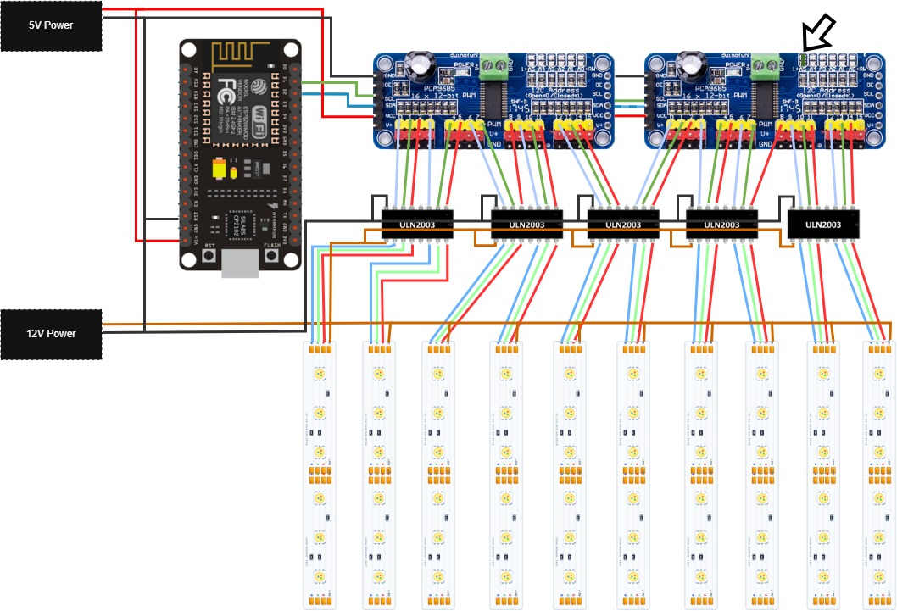
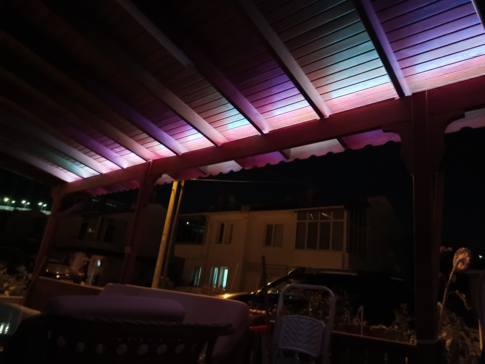
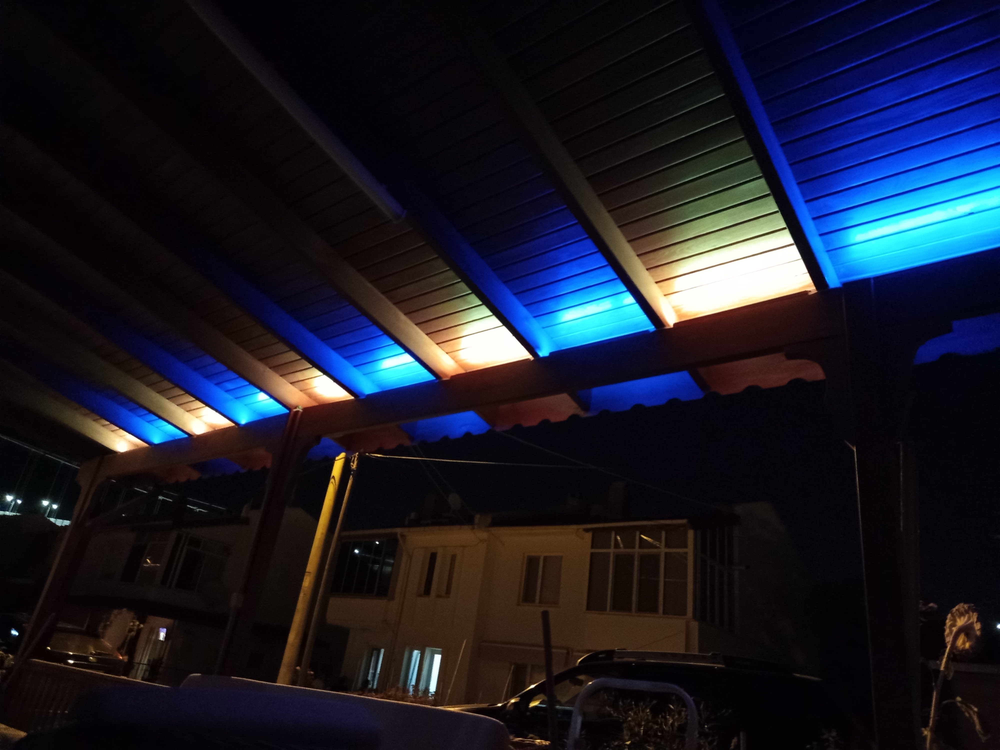
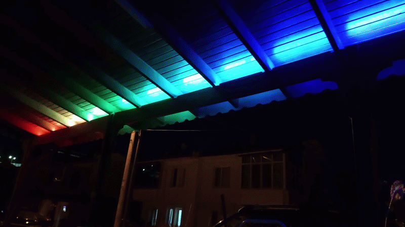
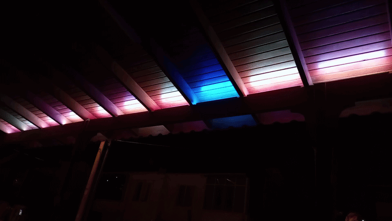

# RGB-Controller
NodeMCU (ESP8266) ve 2x PCA9685 ile 10 Kanallı Web Kontrollü RGB LED Sürücü

# 10 Kanallı RGB LED Kontrol Paneli (ESP8266 + 2x PCA9685)

NodeMCU (ESP8266), 2 adet PCA9685 PWM sürücü ve ULN2003 transistör dizilimleri kullanılarak geliştirilmiş, web arayüzü üzerinden kontrol edilebilen 10 kanallı yüksek güçlü RGB LED kontrol sistemi.

Özellikler

* **Web Arayüzü:** Dahili web sunucu üzerinden mobil/masaüstü uyumlu kontrol paneli.
* **18 Farklı Çalışma Modu:** Sabit renk, tekli LED kontrolü, nefes, meteor, gökkuşağı, alev, kara şimşek vb.
* **12-bit Gamma Düzeltmesi:** Düşük parlaklık seviyelerinde dahi basamaksız, göze doğrusal geçişler.
* **Optimize I2C Trafiği:** Framebuffer ve gölge tampon mimarisiyle sadece değişen PWM kanalları I2C hattına basılır.
* **OTA Desteği:** Tarayıcı üzerinden kablosuz bellenim güncelleme (`/update`).
* **Açılış Animasyonu:** Sistem açıldığında sıcak beyaz (#FFD9A8) tonunda 4 fazlı akıcı başlangıç sekansı.

Donanım Gereksinimleri

* 1x NodeMCU V3 (ESP8266)
* 2x PCA9685 16-Kanal 12-bit PWM Modülü
* 5x ULN2003A Darlington Transistör Dizisi
* 10x Ortak Anot (Common Anode) 12V RGB LED Şerit / Bar
* 1x 12V Güç Kaynağı (LED'ler için)
* 1x 5V Güç Kaynağı (NodeMCU ve PCA9685 lojik beslemesi için)

> **Önemli Donanım Notları:**
> 1. İkinci PCA9685 modülünün adresini **0x41** yapmak için kart üzerindeki **A0** adres lehim köprüsü birleştirilmelidir (varsayılan: 0x40).
> 2. 5V ve 12V güç kaynaklarının **GND (eksi)** hatları birbirine bağlanarak ortak şase yapılmalıdır.

Bağlantı Şeması

Gerekli Arduino Kütüphaneleri

Arduino IDE > Kütüphane Yöneticisi üzerinden kurulması gerekenler:
* `Adafruit PWM Servo Driver Library`
* `WiFiManager` (tzapu)
* `ESP8266WiFi` & `ESP8266WebServer` (ESP8266 board paketiyle gelir)

Kurulum

1. `RGB_Controller/RGB_Controller.ino` dosyasını Arduino IDE ile açın.
2. Kart olarak **NodeMCU 1.0 (ESP-12E Module)** seçin.
3. Kodu karta yükleyin.
4. Cihaz açıldığında oluşturacağı `NodeMCU-LED-Kontrol` isimli Wi-Fi ağına bağlanarak ev ağınızın bilgilerini girin.
5. Tarayıcınızdan `http://ledpanel.local` veya seri monitörde yazan IP adresine (`192.168.1.202`) gidin.

Görseller ve Animasyonlar

### Proje Görselleri

### Efekt Demoları

